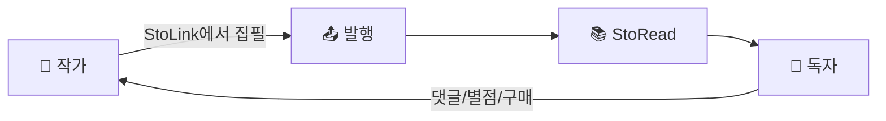

# 📚 StoRead Frontend

> **AI 스마트 스토리 플랫폼** - 독자 서비스 및 작가 배포 시스템
>
> 작품 탐색, 챕터 읽기, 댓글, 좋아요, 북마크, 별점, 결제(크레딧) 기능을 제공하는 독자 중심 플랫폼

---

## 🎯 서비스 소개

### 비전

**StoRead**는 작가와 독자를 연결하는 **AI 기반 웹소설 플랫폼**입니다. 작가가 [StoLink](../stolink_frontend)에서 집필한 작품을 독자에게 전달하고, 독자는 몰입감 있는 환경에서 작품을 감상할 수 있습니다.

### 핵심 가치

| 가치 | 설명 |
|------|------|
| 🔒 **콘텐츠 보호** | 복사/캡처 방지, 보안 뷰어로 작가의 저작권 보호 |
| 📖 **몰입감 있는 독서** | 폰트, 테마, 줄간격 등 개인화된 읽기 환경 제공 |
| 🤝 **커뮤니티** | 댓글, 별점, 좋아요를 통한 작가-독자 소통 |
| 💎 **공정한 수익화** | 크레딧 기반 유료 챕터 시스템으로 창작자 지원 |
| 🔗 **AI 연동** | StoLink의 캐릭터 관계도, AI 분석 결과 시각화 |

### 대상 사용자



- **독자**: 웹소설/연재물을 탐색하고 읽는 사용자
- **작가**: StoLink와 연동하여 작품을 배포하는 창작자
- **유료 구독자**: 크레딧을 충전하여 프리미엄 챕터를 구매하는 사용자

---

## 🏗️ 시스템 아키텍처

```
┌─────────────────────────────────────────────────────────────────┐
│                        StoLink Ecosystem                         │
├─────────────────────────────┬───────────────────────────────────┤
│     StoLink (작가 도구)      │        StoRead (독자 플랫폼)       │
│  ┌─────────────────────┐    │    ┌─────────────────────────┐    │
│  │ stolink_frontend    │    │    │ storead_frontend        │    │
│  │ (React, Tiptap)     │    │    │ (React, Viewer)         │    │
│  └──────────┬──────────┘    │    └──────────┬──────────────┘    │
│             ↓               │               ↓                   │
│  ┌─────────────────────┐    │    ┌─────────────────────────┐    │
│  │ stolink_spring      │◄───┼───►│ storead_spring          │    │
│  │ (Spring Boot)       │    │    │ (Spring Boot)           │    │
│  └──────────┬──────────┘    │    └──────────┬──────────────┘    │
│             ↓               │               ↓                   │
│  ┌──────────┴───────────────┴───────────────┴──────────┐        │
│  │              PostgreSQL + Neo4j (공유 DB)            │        │
│  └──────────────────────────────────────────────────────┘        │
└─────────────────────────────────────────────────────────────────┘
                              ↓
              ┌───────────────────────────────┐
              │  stolink_fastapi_image (AI)   │
              │  - 캐릭터 프로필 생성          │
              │  - 관계도 분석                 │
              └───────────────────────────────┘
```

### 백엔드 연동

| 서비스 | 설명 | 포트 |
|--------|------|------|
| **storead_spring** | 독자 플랫폼 API (작품, 챕터, 결제) | 8081 |
| **stolink_spring** | 작가 도구 API (문서, 발행) | 8080 |
| **stolink_fastapi_image** | AI 이미지/분석 서비스 | 8000 |
| **PostgreSQL** | 관계형 데이터베이스 | 5432 |
| **Neo4j** | 캐릭터 관계 그래프 DB | 7687 |

---

## 🌐 배포 환경

### 프로덕션 (AWS)

| 구성요소 | 서비스 | 설명 |
|----------|--------|------|
| **프론트엔드** | S3 + CloudFront | 정적 파일 호스팅 및 CDN |
| **백엔드** | ECS / App Runner | 컨테이너화된 Spring Boot |
| **데이터베이스** | RDS (PostgreSQL) | 관리형 DB |
| **그래프 DB** | Neo4j AuraDB | 관계도 데이터 |
| **결제** | TossPayments | 크레딧 충전 |

### 개발 환경

```bash
# 로컬 개발 실행
npm run dev                    # Frontend (localhost:5174)
docker compose up -d           # Backend + DB (localhost:8081)
```

---

## 📱 주요 사용자 플로우

### 1. 독자 플로우

```
홈페이지 → 장르/랭킹 탐색 → 작품 상세 → 챕터 선택
    ↓
(무료) 바로 읽기 ← 보안 뷰어 → 가독성 설정
    ↓
(유료) 크레딧 확인 → 부족시 충전 → 챕터 구매 → 읽기
    ↓
댓글 작성 / 별점 평가 / 좋아요 / 북마크
```

### 2. 작가 플로우

```
StoLink에서 작품 집필 → Draft 생성 → 발행(Publish)
    ↓
StoRead 대시보드 → 작품 관리 → 챕터 가격 설정
    ↓
독자 반응 확인 (댓글, 별점, 조회수)
```

---

## 🛠 기술 스택

| 영역               | 기술                                        |
| ------------------ | ------------------------------------------- |
| **Core**           | React 19, TypeScript 5.7, Vite 6.3          |
| **Styling**        | Tailwind CSS 4.1, shadcn/ui, Radix UI       |
| **Server State**   | TanStack Query 5.90                         |
| **Client State**   | Zustand 5.0                                 |
| **Forms**          | React Hook Form 7.69, Zod 4.3               |
| **Routing**        | React Router DOM 7.x                        |
| **Animation**      | Framer Motion 11.x                          |
| **Visualization**  | D3.js 7.x, React Force Graph                |
| **3D Graphics**    | Three.js, @react-three/fiber                |
| **Payment**        | TossPayments SDK                            |

---

## 🚀 시작하기

### 필수 조건

- Node.js 20.x 이상 (`.nvmrc` 참조)
- npm 10.x 이상

### 의존성 설치

```bash
npm install
```

### 개발 서버 실행

```bash
npm run dev
```

→ http://localhost:5174 접속 (stolink_frontend와 포트 충돌 방지)

### 프로덕션 빌드

```bash
npm run build
npm run preview  # 빌드 결과 미리보기
```

---

## 🌐 환경 변수

`.env` 파일 생성 (`.env.example` 참조):

```env
VITE_API_URL=http://localhost:8081/api
```

---

## 📁 프로젝트 구조

```
storead_frontend/
├── src/
│   ├── api/                    # API 클라이언트 (Axios 인스턴스 + 인터셉터)
│   ├── adapters/               # 외부 데이터 변환 어댑터
│   ├── components/             # 재사용 컴포넌트 (125개+)
│   │   ├── CharacterGraph/     # 캐릭터 관계도 (D3 기반)
│   │   ├── comments/           # 댓글 관련 컴포넌트
│   │   ├── common/             # 공통 컴포넌트
│   │   ├── gamification/       # 게이미피케이션 요소
│   │   ├── home/               # 홈 페이지 컴포넌트
│   │   ├── layout/             # 레이아웃 (Header, ProtectedRoute 등)
│   │   ├── payment/            # 결제 관련 컴포넌트
│   │   ├── rating/             # 별점 컴포넌트
│   │   ├── ui/                 # shadcn/ui 컴포넌트 (24개)
│   │   ├── viewer/             # 보안 뷰어 및 설정
│   │   └── writer/             # 작가 전용 컴포넌트
│   │
│   ├── hooks/                  # 커스텀 훅 (27개)
│   │   ├── useAuth.ts          # 인증 (로그인/회원가입/로그아웃)
│   │   ├── useDiscovery.ts     # 작품 탐색/검색
│   │   ├── useLibrary.ts       # 내 서재
│   │   ├── useWorks.ts         # 작가 작품 관리
│   │   ├── useChapters.ts      # 작가 챕터 관리
│   │   ├── useComments.ts      # 댓글 관리
│   │   ├── useRating.ts        # 별점 시스템
│   │   ├── useCredits.ts       # 크레딧 관리
│   │   ├── useChapterPurchase.ts # 챕터 구매
│   │   ├── useSecureContent.ts # 콘텐츠 보안
│   │   └── ...
│   │
│   ├── pages/                  # 페이지 컴포넌트 (13개+)
│   │   ├── Auth/               # 인증 (로그인, 회원가입)
│   │   ├── Author/             # 작가 대시보드 및 관리
│   │   ├── Profile/            # 프로필 관리
│   │   ├── payment/            # 결제 페이지
│   │   ├── HomePage.tsx        # 공개 홈
│   │   ├── WorkDetailPage.tsx  # 작품 상세
│   │   ├── ChapterViewerPage.tsx # 챕터 뷰어
│   │   ├── LibraryPage.tsx     # 내 서재
│   │   ├── RankingPage.tsx     # 랭킹 페이지
│   │   ├── CategoryPage.tsx    # 카테고리별 탐색
│   │   └── WritePage.tsx       # 작성 페이지
│   │
│   ├── services/               # 도메인 서비스 (3개)
│   │   ├── authService.ts      # 인증 서비스
│   │   ├── creditService.ts    # 크레딧 서비스
│   │   └── paymentService.ts   # 결제 서비스
│   │
│   ├── stores/                 # Zustand 스토어 (3개)
│   │   ├── useAuthStore.ts     # 인증 상태 관리
│   │   ├── useAuthModalStore.ts # 인증 모달 상태
│   │   └── useTheme.ts         # 테마 상태 관리
│   │
│   ├── types/                  # 타입 정의 (7개)
│   │   ├── index.ts            # 메인 타입 (Work, Chapter 등)
│   │   ├── character.ts        # 캐릭터 관련 타입
│   │   ├── credit.ts           # 크레딧 타입
│   │   ├── payment.ts          # 결제 타입
│   │   └── ...
│   │
│   ├── constants/              # 상수 정의
│   ├── data/                   # 데모/목 데이터
│   ├── lib/                    # 유틸리티 함수
│   └── utils/                  # 헬퍼 함수
│
├── e2e/                        # E2E 테스트 (Playwright)
│   ├── fixtures/               # 테스트 설정
│   └── tests/                  # 테스트 파일 (discovery, social, viewer)
│
├── docs/                       # 문서
├── public/                     # 정적 파일
└── dist/                       # 빌드 출력
```

---

## ✨ 주요 기능

### 📖 독자 서비스

| 기능              | 설명                                       |
| ----------------- | ------------------------------------------ |
| **작품 탐색**     | 장르별 필터, 검색, 랭킹                    |
| **작품 상세**     | 표지, 줄거리, 챕터 리스트, 캐릭터 관계도   |
| **보안 뷰어**     | 복사/우클릭/드래그 차단                    |
| **가독성 설정**   | 폰트 크기, 테마(라이트/다크), 줄 간격      |
| **소셜 기능**     | 별점, 계층형 댓글, 좋아요                  |
| **내 서재**       | 관심 작품 북마크 및 정렬                   |
| **결제 시스템**   | TossPayments 연동 크레딧 구매              |
| **챕터 구매**     | 크레딧으로 유료 챕터 열람                  |

### ✍️ 작가 서비스

| 기능              | 설명                                        |
| ----------------- | ------------------------------------------- |
| **대시보드**      | 내 작품 목록 조회 및 통합 관리              |
| **작품 관리**     | 새 작품 생성, 정보 수정, 삭제               |
| **챕터 관리**     | 챕터 작성, 수정, 삭제, 순서 관리            |
| **StoLink 연동**  | StoLink에서 작성한 챕터 가져오기            |
| **프로필 관리**   | 작가 프로필 정보 수정                       |

---

## 🔗 StoLink 연동

StoRead는 **StoLink (작가용 집필 도구)**와 연동됩니다:

| 항목         | StoLink (작가)   | StoRead (독자) |
| ------------ | ---------------- | -------------- |
| **Document** | 원본 문서 편집   | -              |
| **Draft**    | 발행 준비        | -              |
| **Work**     | projectId 연결   | 작품 열람      |
| **Chapter**  | documentId 연결  | 챕터 열람      |

**발행 플로우**: `StoLink Document → Draft → StoRead Chapter`

---

## 🧪 테스트

### Unit & Integration Tests (Vitest)

`src/__tests__/qa` 디렉토리에서 주요 기능과 API에 대한 테스트를 관리합니다.

```bash
# 전체 테스트 실행
npm test

# 특정 파일 실행
npm test src/__tests__/qa/api
```

### E2E Tests (Playwright)

`e2e/tests` 디렉토리에서 End-to-End 테스트를 관리합니다.

```bash
# E2E 테스트 실행
npm run test:e2e

# UI 모드로 실행
npm run test:e2e:ui

# 브라우저 표시 모드
npm run test:e2e:headed
```

**테스트 범위**:
- `discovery.spec.ts` - 작품 탐색 및 검색
- `viewer.spec.ts` - 챕터 뷰어 기능
- `social.spec.ts` - 소셜 기능 (댓글, 좋아요, 별점)

---

## 🔗 API 엔드포인트

| 영역       | 엔드포인트                      | Method       |
| ---------- | ------------------------------- | :----------: |
| **인증**   | `/api/auth/login`               | POST         |
|            | `/api/auth/register`            | POST         |
|            | `/api/auth/me`                  | GET          |
| **탐색**   | `/api/discovery`                | GET          |
|            | `/api/discovery/ranking`        | GET          |
| **작품**   | `/api/works`                    | GET/POST     |
|            | `/api/works/:id`                | GET/PUT/DEL  |
| **챕터**   | `/api/works/:workId/chapters`   | GET/POST     |
|            | `/api/chapters/:id`             | GET/PUT/DEL  |
| **서재**   | `/api/library`                  | GET/POST/DEL |
| **댓글**   | `/api/chapters/:id/comments`    | GET/POST     |
| **결제**   | `/api/payments`                 | POST         |
| **크레딧** | `/api/credits`                  | GET          |

---

## 📝 스크립트 명령어

| 명령어                | 설명                                |
| --------------------- | ----------------------------------- |
| `npm run dev`         | 개발 서버 시작 (localhost:5174)     |
| `npm run build`       | 프로덕션 빌드 (tsc + vite build)    |
| `npm run preview`     | 빌드 결과 미리보기                  |
| `npm run lint`        | ESLint 검사                         |
| `npm test`            | Vitest 테스트 실행                  |
| `npm run test:e2e`    | Playwright E2E 테스트 실행          |
| `npm run test:e2e:ui` | Playwright UI 모드 실행             |

---

## 📝 코드 컨벤션

### 파일 네이밍

- 컴포넌트: `PascalCase.tsx`
- 훅: `useCamelCase.ts`
- 서비스: `xxxService.ts`
- 타입: `camelCase.ts`

### 커밋 메시지 (Conventional Commits)

- `feat`: 새로운 기능
- `fix`: 버그 수정
- `docs`: 문서 변경
- `style`: 코드 포맷팅
- `refactor`: 리팩토링
- `perf`: 성능 개선
- `test`: 테스트 추가
- `chore`: 빌드/설정 변경

---

## 🔧 빌드 최적화

Vite 빌드 설정에서 다음과 같이 청크를 분리합니다:

| 청크 이름        | 포함 라이브러리                         |
| ---------------- | --------------------------------------- |
| `vendor-react`   | react, react-dom, react-router-dom      |
| `vendor-ui`      | @radix-ui/* 컴포넌트                    |
| `vendor-query`   | @tanstack/react-query                   |
| `vendor-motion`  | framer-motion                           |
| `vendor-d3`      | d3, d3-delaunay                         |
| `vendor-three`   | three, @react-three/fiber               |
| `vendor-payment` | @tosspayments/* (지연 로드)             |

---

## 📄 관련 문서

| 문서                          | 설명                              |
| ----------------------------- | --------------------------------- |
| `CLAUDE.md`                   | AI 모델용 프로젝트 컨텍스트       |
| `FRONTEND_INTEGRATION_GUIDE.md` | 프론트엔드 통합 가이드          |
| `IMPLEMENTATION_STATUS.md`    | 구현 현황                         |
| `docs/TROUBLESHOOTING.md`     | 트러블슈팅 기록                   |

---

## 📄 라이선스

Private - All Rights Reserved

---

## 버전 정보

- **Frontend Version**: 0.0.0
- **Last Updated**: 2026-01-21
